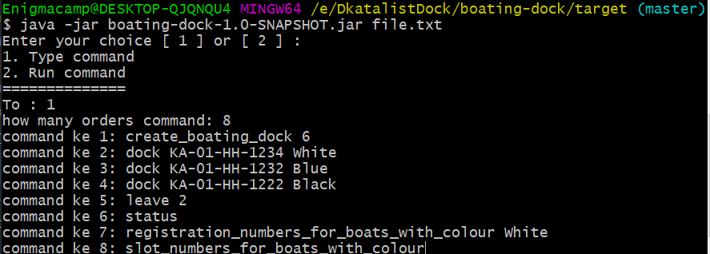
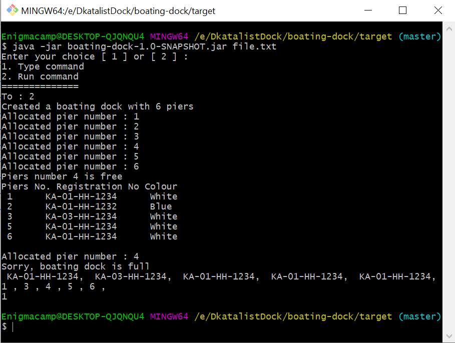

## Boating Dock Challange

=========

This application There are 2 choices
1. the first choice you can enter the command code
2. the second option you can run commands directly from a file that contains commands to run applications

#HOW TO RUNNING APPLICATION

#if you choice mode 1 :
1. To install, compile and  run test:

* #mvn clean install

2. To run the code open folder target when type command :

* #java -jar name_file.jar file_inputs.txt
3. choice your mode 1 
4. type how many command
5. type your command 

application can run if end type command

example :

#if you choice mode 2  
1. To install, compile and  run test:

* #mvn clean install
2. move  your file_inputs.txt to folder target

3. To run the code open folder target when type command :

* #java -jar name_file.jar file_inputs.txt

4. choice your mode 2 

application can run if end type command

example :

=========
# Input (contents of file)
 create_boating_dock 6

 dock KA-01-HH-1234 White

 dock KA-01-HH-1234 White

 dock KA-01-HH-1234 White

 dock KA-01-HH-1234 White

 dock KA-01-HH-1234 White

 dock KA-01-HH-1234 White

 leave 4

 status

 dock KA-01-HH-1234 White

 dock KA-01-HH-1234 White

 registration_numbers_for_boats_with_colour white

 slot_numbers_for_boats_with_colour white

 slot_number_for_registration_number KH-01-JJ-3141

 ========
 #output
 Created a boating dock with 6 piers
 
 Allocated pier number : 1
  
 Allocated pier number : 2 
 
 Allocated pier number : 3 
 
 Allocated pier number : 4 
 
 Allocated pier number : 5 
 
 Allocated pier number : 6 
 
 Piers number 4 is free  
 
 Piers No. Registration No Colour 

  1      KA-01-HH-1234      White      
  2      KA-01-HH-1234      White      
  3      KA-01-HH-1234      Read      
  5      KA-01-HH-1234      Blue      
  6      KA-01-HH-1234      White      
 
 Allocated pier number : 4 
 
 Sorry, boating dock is full
 
  KA-01-HH-1234,  KA-01-HH-1234,  KA-01-HH-1234,  KA-01-HH-1234
 
 1 , 2 , 4 , 6 
 
 Not found

